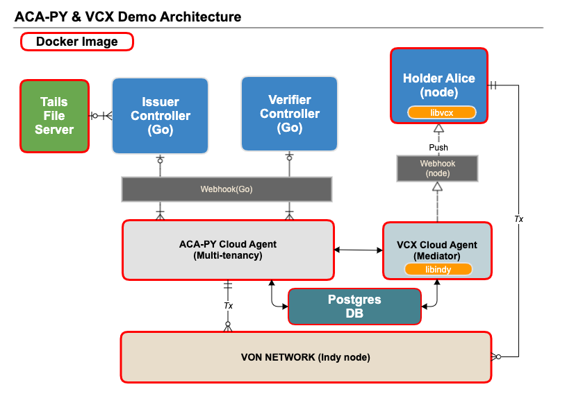

# ACA-PY & VCX Demo

This is a ACA-PY & VCX interoperability Demo test.



* Demo Repository : https://github.com/sktston/acapy-vcx-demo
* ACA-PY : https://github.com/hyperledger/aries-cloudagent-python
* VCX Agency : https://github.com/AbsaOSS/vcxagencynode
* Libvcx(Aries-vcx) : https://github.com/hyperledger/aries-vcx
* Indy VON Network : https://github.com/bcgov/von-network
* Indy tails file server : https://github.com/bcgov/indy-tails-server
* PostgreSQL : https://www.postgresql.org/


### Pre-requirements
#### Docker
Before you'll be able to run demo, you need docker 
- Docker Engine, Docker Compose : https://www.docker.com/

As in docker-for-mac and docker-for-windows, inside a container, the DNS name host.docker.internal resolves to an IP address allowing network access to the host.
```shell script
vim /etc/host
# Add below info
127.0.0.1       host.docker.internal 
```
**Note**: It is highly recommended to use 4 CPUs and 4GB Memory in Docker engine settings.


#### VON-NETWORK
You'll also have to run pool of Indy nodes on your machine. You can achieve by simply running a docker container
which encapsulates multiple interconnected Indy nodes.
```shell script
git clone https://github.com/bcgov/von-network
cd von-network
./manage build
./manage start
```
Running VON-NETWOK also runs a thin webserver (at http://localhost:9000 when using docker) to expose some convenience functions.<br>
http://host.docker.internal:9000/ or http://localhost:9000/

#### Tails file server
You need tails server for credential Revocation tests.
```shell script
git clone https://github.com/bcgov/indy-tails-server
cd indy-tails-server/docker
./manage start
```


## Run Demo
- The demo represents example how 3 actors, **Alice**, **Faber(Issuer)**  and **Faber(Verifier)** institution, exchange credentials.
- This demo uses the `multitenancy` branch of ACA-PY, not the `master`. Note that the OpenAPI behavior of `master` and `multitenancy` is different.

#### ACA-PY & VCX Cloud Agent with PostgreSQL
You need two cloud agents for demo.

1. ACA-PY cloud agent : issuer/verifier를 위한 agent. 이번 test는 multitenancy branch를 사용.
2. VCX Agency : holder를 위한 Mediator
**Note**: Please use this docker setting because of a network issue.

```shell script
git clone https://github.com/sktston/acapy-vcx-demo.git
cd acapy-vcx-demo/acapy_vcx_agents
docker-compose up
```
**Note**: The first time you build docker image, it will take more than 20 minutes.

If you see the following message, it is ready.

```shell script
acapy-agent_1     | ::::::::::::::::::::::::::::::::::::::::::::::
acapy-agent_1     | :: cloud.agent                              ::
acapy-agent_1     | ::                                          ::
acapy-agent_1     | ::                                          ::
acapy-agent_1     | :: Inbound Transports:                      ::
acapy-agent_1     | ::                                          ::
acapy-agent_1     | ::   - http://0.0.0.0:8020                  ::
acapy-agent_1     | ::                                          ::
acapy-agent_1     | :: Outbound Transports:                     ::
acapy-agent_1     | ::                                          ::
acapy-agent_1     | ::   - http                                 ::
acapy-agent_1     | ::   - https                                ::
acapy-agent_1     | ::                                          ::
acapy-agent_1     | :: Public DID Information:                  ::
acapy-agent_1     | ::                                          ::
acapy-agent_1     | ::   - DID: Th7MpTaRZVRYnPiabds81Y          ::
acapy-agent_1     | ::                                          ::
acapy-agent_1     | :: Administration API:                      ::
acapy-agent_1     | ::                                          ::
acapy-agent_1     | ::   - http://0.0.0.0:8021                  ::
acapy-agent_1     | ::                                          ::
acapy-agent_1     | ::                               ver: 0.5.5 ::
acapy-agent_1     | ::::::::::::::::::::::::::::::::::::::::::::::
acapy-agent_1     |
acapy-agent_1     | Listening...
```
ACA-Py provides an OpenAPI-documented REST interface for adminstering the agent's internal state and sparking communication with connected agents.<br>
http://localhost:8021/api/doc#/
**Note**: If you want to use Open API admin, click on authorize in the upper right corner of the admin site and enter'admin' for authorize.


#### Issuer/Verifier Controller

You need Golang for issuer and verifier controller build.
<br>
See the https://golang.org/dl/ for more information about Go download

```shell script
% cd acapy-vcx-demo/faber
% go version
go version go1.15.2 darwin/amd64
% go build
```

Start Issuer
```shell script
% ./faber -i
.
.
.
[INFO]  - credential definition ID: 3Mdien1LGc6jQXTegwgQ7Z:3:CL:13:tag.24.65.71
[INFO]  Initialization is done.
[INFO]  Run alice now.
[INFO]  Waiting web hook event from agent...

```

Start Verifier
```shell script
% ./faber -v
.
.
.
[INFO]  - schema ID:
[INFO]  - credential definition ID:
[INFO]  Initialization is done.
[INFO]  Run alice now.
[INFO]  Waiting web hook event from agent...

```

If you want to change port or ip, edit `faber-config.json`
```json
{
  "AgentApiUrl"        : "http://host.docker.internal:8021",
  "IssuerWebhookUrl"   : "http://host.docker.internal:8022/webhooks",
  "VerifierWebhookUrl" : "http://host.docker.internal:8032/webhooks",
  "SupportRevoke"      : false,
  "RevokeAfterIssue"   : false,
  "Debug"              : false
}
```

#### Alice Holder

```shell script
% cd acapy-vcx-demo/node-alice
% docker-compsoe up
```

**Note**: The first time you build docker image, it will take more than 20 minutes.

If you see the message below, the test is complete.


```shell script
node-alice_1  | [10-26 01:27:45] [verbose]: Alice[1] Alice demo is completed
node-alice_1  | [10-26 01:27:45] [verbose]: Alice[1] shutdown VCX with deleting wallet
node-alice_1  | [10-26 01:27:46] [verbose]: Worker 12 exits successfully
node-alice_1  | [10-26 01:27:46] [verbose]:
node-alice_1  | [10-26 01:27:46] [verbose]: ------ Onboard Performance ------
node-alice_1  | [10-26 01:27:46] [verbose]: *** Throughput ***
node-alice_1  | [10-26 01:27:46] [verbose]: Duration 4.7 secs to 1 transactions.
node-alice_1  | [10-26 01:27:46] [verbose]: PerSec 0.2  PerMinute 12.8
node-alice_1  | [10-26 01:27:46] [verbose]:
node-alice_1  | [10-26 01:27:46] [verbose]: *** Transaction time (sec) ***
node-alice_1  | [10-26 01:27:46] [verbose]: Min 4.7  Max 4.7
node-alice_1  | [10-26 01:27:46] [verbose]: Median 4.7  Variance 0.00
node-alice_1  | [10-26 01:27:46] [verbose]: Quantile[0.95, 0.99]=[4.7,4.7]
node-alice_1  | [10-26 01:27:46] [verbose]: ------------------------------------
node-alice_1  | [10-26 01:27:46] [verbose]:
node-alice_1  | [10-26 01:27:46] [verbose]: ------ Issue Performance ------
node-alice_1  | [10-26 01:27:46] [verbose]: *** Throughput ***
node-alice_1  | [10-26 01:27:46] [verbose]: Duration 4.6 secs to 1 transactions.
node-alice_1  | [10-26 01:27:46] [verbose]: PerSec 0.2  PerMinute 12.9
node-alice_1  | [10-26 01:27:46] [verbose]:
node-alice_1  | [10-26 01:27:46] [verbose]: *** Transaction time (sec) ***
node-alice_1  | [10-26 01:27:46] [verbose]: Min 4.6  Max 4.6
node-alice_1  | [10-26 01:27:46] [verbose]: Median 4.6  Variance 0.00
node-alice_1  | [10-26 01:27:46] [verbose]: Quantile[0.95, 0.99]=[4.6,4.6]
node-alice_1  | [10-26 01:27:46] [verbose]: ------------------------------------
node-alice_1  | [10-26 01:27:46] [verbose]:
node-alice_1  | [10-26 01:27:46] [verbose]: ------ Verify Performance ------
node-alice_1  | [10-26 01:27:46] [verbose]: *** Throughput ***
node-alice_1  | [10-26 01:27:46] [verbose]: Duration 3.9 secs to 1 transactions.
node-alice_1  | [10-26 01:27:46] [verbose]: PerSec 0.3  PerMinute 15.2
node-alice_1  | [10-26 01:27:46] [verbose]:
node-alice_1  | [10-26 01:27:46] [verbose]: *** Transaction time (sec) ***
node-alice_1  | [10-26 01:27:46] [verbose]: Min 3.9  Max 3.9
node-alice_1  | [10-26 01:27:46] [verbose]: Median 3.9  Variance 0.00
node-alice_1  | [10-26 01:27:46] [verbose]: Quantile[0.95, 0.99]=[3.9,3.9]
node-alice_1  | [10-26 01:27:46] [verbose]: ------------------------------------
node-alice_1  | [10-26 01:27:46] [verbose]:
node-alice_1  | [10-26 01:27:46] [verbose]: ------ Total Performance ------
node-alice_1  | [10-26 01:27:46] [verbose]: *** Throughput ***
node-alice_1  | [10-26 01:27:46] [verbose]: Duration 13.3 secs to 3 transactions.
node-alice_1  | [10-26 01:27:46] [verbose]: PerSec 0.2  PerMinute 13.5
node-alice_1  | [10-26 01:27:46] [verbose]:
node-alice_1  | [10-26 01:27:46] [verbose]: *** Transaction time (sec) ***
node-alice_1  | [10-26 01:27:46] [verbose]: Min 3.9  Max 4.7
node-alice_1  | [10-26 01:27:46] [verbose]: Median 4.6  Variance 0.12
node-alice_1  | [10-26 01:27:46] [verbose]: Quantile[0.95, 0.99]=[4.7,4.7]
node-alice_1  | [10-26 01:27:46] [verbose]: ------------------------------------
node-alice_node-alice_1 exited with code 0
```
 
 
## To do

For compatibility test with the latest library, This demo use latest `libindy` and `libvcx` source-code compile when docker builds. This part will be optimized in the future.
So it takes a long time because of this issue
<br> We plan to optimize in the future.
